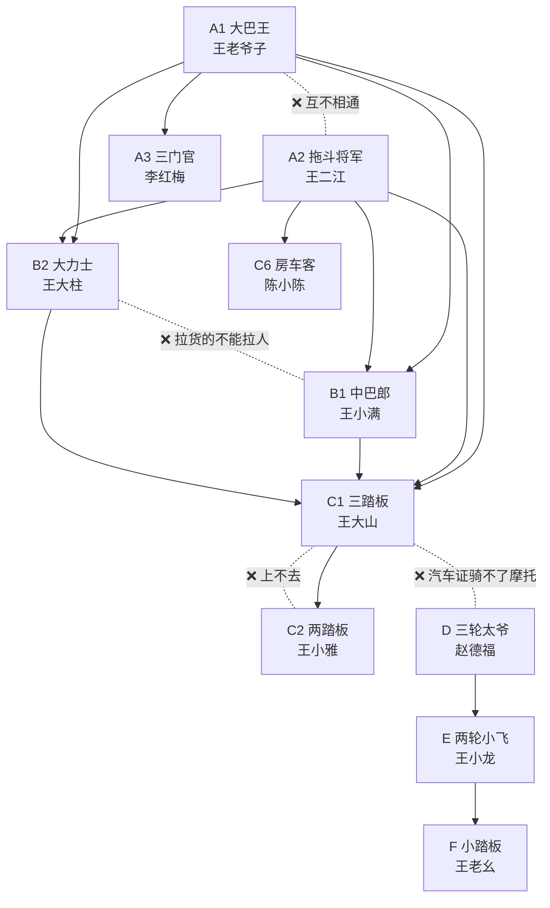

# 2.1 准驾代号全家福（称号表 + 车图鉴 + 故事 + 习题）

> 一个文件全包：**先认人 → 看车 → 读故事 → 记口诀 → 做题**。
> 代号记不住很正常，因为 A1、B2 这些字母本身没有意义。
> 解决办法：**每个代号 = 一个人 + 一个外号 + 一辆车**，脑子里记的是画面，不是字母。

---

## 一、全家福称号表

| 代号 | 姓名 | 外号 | 开的车 | 一句话人设 |
| --- | --- | --- | --- | --- |
| **A1** | 王老爷子 | **大巴王** | 长途大巴 | 坐着全家族最大的车，一号最大 |
| **A2** | 王二江（二弟） | **拖斗将军** | 半挂牵引车 | 车后拖两节货厢，能开遍小车中巴大货 |
| **A3** | 李红梅（媳妇） | **三门官** | 城市公交车 | 三个门，只能往下开小车 |
| **B1** | 王小满（表弟） | **中巴郎** | 11 座中巴 | 专门拉 10~19 个人 |
| **B2** | 王大柱（堂哥） | **大力士** | 大货车 | 装得下两头大象，只拉货不拉人 |
| **C1** | 王大山（老王） | **三踏板** | 手动挡捷达 | 脚下三个踏板，多一个离合 |
| **C2** | 王小雅（女儿） | **两踏板** | 自动挡小车 | 脚下两个踏板，开不了老爸的车 |
| **C6** | 陈小陈（邻居） | **房车客** | 拖挂房车 | 拖小房车露营，不到 4500kg |
| **D** | 赵德福（赵大爷） | **三轮太爷** | 三轮摩托 | 摩托界老大，三轮二轮轻便全包 |
| **E** | 王小龙（儿子） | **两轮小飞** | 二轮摩托 | 只能骑两轮，骑不了三轮 |
| **F** | 王老幺（小叔） | **小踏板** | 轻便摩托 | 最轻最慢，F 笔画最少 |

### 这一家子 = 全笔记通用班底

**后面所有章节都用这几个人，不再另起新人物。** 记一次人，用到底。

| 人物 | 代号 | 后面章节里扮演的角色 | 会出现在 |
| --- | --- | --- | --- |
| 王小雅（女儿） | C2 | **新手学员 / 实习期司机** —— 所有"新手容易犯的错"都让她来犯 | 实习期、记分、标志、事故 |
| 王大山（老王） | C1 | **老司机 / 正确示范** —— 负责讲道理、做对操作 | 全章节 |
| 王老爷子（爷爷） | A1 | 乘客 / 老人 | 安全带、大巴逃生、事故 |
| 王二江（二弟） | A2 | 职业长途司机 | 疲劳驾驶、高速公路、超限 |
| 李红梅（媳妇） | A3 | 公交司机 | 礼让行人、站点停靠、公交专用道 |
| 王小满（表弟） | B1 | 中巴司机 | 超员、校车避让 |
| 王大柱（堂哥） | B2 | 货车司机 | 超载、超限、货物捆扎 |
| 陈小陈（邻居） | C6 | 自驾游 / 露营 | 高速、拖挂、恶劣天气 |
| 赵德福（赵大爷） | D | 村里老人 | 人行横道、老年人过街、农用车 |
| 王小龙（儿子） | E | 年轻骑手 | 头盔、飙车、不按车道行驶 |
| 王老幺（小叔） | F | 轻便摩托骑手 | 头盔、违规载人 |

> 后续章节如果确实需要新角色（比如交警、行人小孩），会在那一节单独介绍，主体仍是这一家子。

---

## 二、故事：《老王一家回乡下给奶奶祝寿》

### 第一幕 · 出门前的争执（C1 与 C2）

**C1 · 三踏板 王大山 · 手动挡小轿车**

```
        ________
       / ____  \
   ___/ /    \ \___
  |____|_\____/|____|
     (o)         (o)

  脚下三个踏板： [离合] [刹车] [油门]
```

今天是奶奶 70 大寿，老王那辆**手动挡捷达**，他持的是 **C1**。女儿小雅一把抢过钥匙："爸我来开！"

**C2 · 两踏板 王小雅 · 自动挡小车**

```
        ________
       / ____  \          ← 外形和 C1 一模一样，
   ___/ /    \ \___          光看车看不出区别
  |____|_\____/|____|
     (o)         (o)

  脚下两个踏板：   [刹车] [油门]
```

老王按住钥匙："你考的是 **C2 自动挡**，你那车脚下只有**两个踏板**——刹车和油门。我这车有**三个**，左边多一个**离合**。你开不了。"

小雅不服："就挪个车嘛，才十米。"

"十米也不行。C2 开手动挡，叫**驾驶与准驾车型不符**，一次记 **9 分**，出事保险还不赔。反过来才行——我有 C1，能开你那辆自动挡。"

> **记忆点**：C1 三踏板、C2 两踏板，外形一样，区别只在脚下。
> **C1 能开 C2，C2 开不了 C1。** 自动挡上不去手动挡，多远都不行。

---

### 第二幕 · 爷爷坐的大巴（A1）

**A1 · 大巴王 王老爷子 · 长途大巴**

```
   _____________________________
  |  ┌──┬──┬──┬──┬──┬──┬──┬──┐   |
  |  │  │  │  │  │  │  │  │  │   |
  |  └──┴──┴──┴──┴──┴──┴──┴──┘   |
  |_____________________________|
      (o)                (o)
```

爷爷没跟车走，从省城坐**长途大巴**回来。那车老长老长，**车长 6 米以上、能坐 20 多人**——这就是**大型载客汽车**，代号 **A1**。

老王说："记着，**A1 是最大的客车**，'一号大巴'，一排排小窗户，最长的那辆。"

> **记忆点**：A1 = 大型载客汽车（大巴）。车长 ≥6m 或 载客 ≥20 人。

---

### 第三幕 · 高速上遇见二弟（A2）

**A2 · 拖斗将军 王二江 · 半挂牵引车**

```
       ______       ┌────────────────────┐
      |  __  |      │                    │
      | |  | |______│     集装箱挂厢      │
      |_|__|_|      │                    │
        (o)         └────────────────────┘
                        (o)    (o)    (o)
```

服务区里，二弟说："我这是 **A2 重型牵引挂车**。我这证可牛了——大货 B2、中巴 B1、你那 C1、自动挡 C2 我全能开，拖房车的 **C6** 我也能开。"

小雅眼睛一亮："那爷爷坐的大巴 A1 你也能开吧？"

二弟摆手："**开不了！A1 和 A2 互不相通。** 我要开大巴得重新增驾 A1；同样，A1 的司机也开不了我这挂车。"

> **记忆点**：A2 = 重型牵引挂车，车头自己没货厢，全靠后面拖着。
> A2 兼容 B1、B2、C1、C2、C3、C4、C5、C6、M。
> **但 A1 与 A2 互不相通** —— 最爱考的一道题。

---

### 第四幕 · 汽车站接媳妇（A3）

**A3 · 三门官 李红梅 · 城市公交车**

```
   ____________________________
  | ┌──┐  ┌──┐  ┌──┐  ┌──┐      |
  | └──┘  └──┘  └──┘  └──┘      |
  | [前门][中门]       [后门]    |
  |____________________________|
     (o)                  (o)
```

媳妇是公交车司机。**三个车门**，前门上车、中门下车。

老王介绍："你婶儿这证是 **A3**，'三门公交'。往下能开 C1、C2、C3、C4、C5 这些小车，但**开不了大巴 A1**，也开不了二弟的挂车。"

> **记忆点**：A3 = 城市公交车，"三门公交"，只向下兼容小车型。

---

### 第五幕 · 表弟的中巴和堂哥的大货（B1 / B2）

**B1 · 中巴郎 王小满 · 11 座中巴**

```
      ____________________
     | ┌─┐ ┌─┐ ┌─┐ ┌─┐    |
     | └─┘ └─┘ └─┘ └─┘    |
     |____________________|
        (o)          (o)
```

表弟开来一辆 **11 座中巴**，一趟趟拉亲戚。老王想帮忙开一段，表弟直摇头："哥，你 C1 开不了。我这车车长不到 6 米，但**坐 10 到 19 人**，属于**中型客车**，要 **B1**。你的 C1 只能开 **9 座以下**。"

**B2 · 大力士 王大柱 · 大货车**

```
    ______      ┌────────────────┐
   |  __  |     │                │
   | |  | |_____│    货厢/渣土斗  │
   |_|__|_|     │                │
     (o)        └────────────────┘
                  (o)      (o)
```

堂哥开着**大货车**到了，装满酒水桌椅："**B2 大型货车**，装得下两头大象那么重的货。"

堂哥说："我帮你开中巴吧。"表弟还是摇头："**你 B2 也开不了我 B1！拉货的不能拉人。**"

> **记忆点**：B1 = 中型客车（10~19 人、车长 <6m）；B2 = 大型货车。
> **B2 不能开 B1，C1 也不能开 B1。** "拉货的不能拉人。"

---

### 第六幕 · 邻居的房车（C6）

**C6 · 房车客 陈小陈 · 拖挂房车**

```
    ______          ┌──────────────┐
   / ____ \         │  ┌────────┐  │
  |_|____|_|--------│  │  小屋  │  │
    (o)  (o)        │  └────────┘  │
                    └──────────────┘
                          (o)
```

邻居小陈开着**拖挂式房车**来凑热闹。小雅好奇："拖这么大一个车，得要 A2 吧？"

小陈笑："不用，我这房车**总质量不到 4500 公斤**，属于**轻型牵引挂车**，专门有个代号叫 **C6**。超过 4500 公斤才要 A2。"

> **记忆点**：C6 = 轻型牵引挂车（拖房车），总质量 **< 4500kg**。

---

### 第七幕 · 院子里的三辆摩托（D / E / F）

**D · 三轮太爷 赵德福 · 三轮摩托**

```
       ┌───────────┐
       │  带篷车厢  │
       └─────┬─────┘
            / \
         (O) (O)(O)
          前1轮   后2轮
```

**E · 两轮小飞 王小龙 · 二轮摩托**

```
          ___
     ____/   \____
    (___)      ___)
        \_____/
        (O)   (O)
```

**F · 小踏板 王老幺 · 轻便摩托**

```
        ____
       (____)__
        \__/   \__
          (O)__(O)
```

晚饭前，院子里停了三辆摩托。儿子想去骑赵大爷的三轮兜风，赵大爷拦住："你那 E 只能骑两轮，**骑不了我的三轮**。我这 **D 是摩托里的最高等级**，三轮、二轮、轻便全能骑。"

老王补一句："别看我有 C1，我**一辆摩托都骑不了**。要骑摩托得另考 D 或 E，考完驾照上就印成 **C1D**、**C1E**。"

> **记忆点**：摩托三兄弟 **D > E > F**，字母越靠前级别越高，往下全兼容。
> **C1 不能开任何摩托车。**

---

### 第八幕 · 晚上，老王画了一张表

```
A1 大巴王（最大客车）   A2 拖斗将军（半挂）   A3 三门官（公交）
B1 中巴郎（10-19人）    B2 大力士（大货）
C1 三踏板（手动）  →    C2 两踏板（自动）      C6 房车客（拖挂）
D 三轮太爷  →  E 两轮小飞  →  F 小踏板
```

然后出题考小雅：

1. 你 C2 能开我 C1 的车吗？ → **不能**
2. 二弟 A2 能开爷爷坐的大巴吗？ → **不能**
3. 我 C1 能开表弟 11 座的中巴吗？ → **不能，要 B1**
4. 堂哥 B2 能开表弟的中巴吗？ → **不能，拉货的不能拉人**
5. 我 C1 能骑儿子那辆摩托吗？ → **不能，摩托要另考**
6. 赵大爷 D 能骑儿子的 E 吗？ → **能，D 含 E、F**
7. 开与准驾车型不符的车，记几分？ → **9 分**

---

## 三、关系图

### 文字版

```
══════════════════ 汽车族 ══════════════════

        【A1 大巴王】                    【A2 拖斗将军】
          王老爷子                         王二江
             │                                │
             └────────── ✕ 互不相通 ──────────┘
             │                                │
             ▼                                ▼
        【A3 三门官】                   【B2 大力士】 【B1 中巴郎】
          李红梅                         王大柱        王小满
             │                                │            │
             │                                └──✕─────────┘
             │                                （拉货的不能拉人）
             ▼                                │
        【C1 三踏板】 ◄───────────────────────┘
          王大山
             │
             ▼
        【C2 两踏板】 王小雅  ← 她上不去老爸的 C1

        【C6 房车客】 陈小陈  ← 只有 A2 和 C6 能拖挂

══════════════════ 摩托族（另一棵树）══════════════════

        【D 三轮太爷】 赵德福
             │
             ▼
        【E 两轮小飞】 王小龙
             │
             ▼
        【F 小踏板】   王老幺

   ✕ 汽车族和摩托族完全不通用
     （三踏板老王 C1 一辆摩托都骑不了）

═════════════════════════════════════════════
```

### Mermaid 版（VS Code 里可直接渲染，箭头 = 能开的方向）



> **顺着箭头能开，逆着箭头开不了。**

---

## 四、速查表（考前 3 分钟扫一遍）

| 代号 | 外号 | 车 | 关键数字 | 最容易考的一句话 |
| --- | --- | --- | --- | --- |
| A1 | 大巴王 | 大型载客汽车 | 车长 ≥6m 或 ≥20 人 | 与 A2 互不相通 |
| A2 | 拖斗将军 | 重型牵引挂车 | — | 兼容 B1/B2/C1/C2/C6，但不能开 A1 |
| A3 | 三门官 | 城市公交车 | 核载 ≥10 人 | 只向下兼容小车 |
| B1 | 中巴郎 | 中型载客汽车 | 车长 <6m、10~19 人 | C1、B2 都开不了它 |
| B2 | 大力士 | 大型货车 | — | 拉货的不能拉人（开不了 B1） |
| C1 | 三踏板 | 小型汽车（手动） | ≤9 座 | 能开 C2、C3、C4、C5 |
| C2 | 两踏板 | 小型自动挡 | — | **开不了 C1** |
| C6 | 房车客 | 轻型牵引挂车 | 总质量 <4500kg | 超过就要 A2 |
| D | 三轮太爷 | 普通三轮摩托 | — | 含 E、F，摩托里最大 |
| E | 两轮小飞 | 普通二轮摩托 | — | 骑不了 D |
| F | 小踏板 | 轻便摩托 | — | 最小最轻便 |

---

## 五、口诀

> **大巴王 A1，拖斗将军 A2，两个谁也不服谁（互不相通）。**
> **三门官 A3 开公交，中巴郎 B1 拉十人，大力士 B2 只拉货。**
> **三踏板 C1 包住两踏板 C2，反过来不行。**
> **房车客 C6 拖小厢，不到四吨半。**
> **三轮太爷 D、两轮小飞 E、小踏板 F，字母越靠前越厉害。**
> **汽车和摩托是两家人。**
> **准驾不符 → 记 9 分。**

---

## 六、习题（10 题，点开看答案）

<details>
<summary>第 1 题</summary>

**两踏板闺女想开三踏板老爸的车，行吗？**

不行。C2 开不了 C1，准驾不符，记 9 分。
</details>

<details>
<summary>第 2 题</summary>

**拖斗将军能开大巴王那辆车吗？**

不能。A2 开不了 A1，两者互不相通。
</details>

<details>
<summary>第 3 题</summary>

**大力士能开中巴郎的车吗？**

不能。B2 开不了 B1，拉货的不能拉人。
</details>

<details>
<summary>第 4 题</summary>

**三踏板老王能开中巴郎那辆 11 座的车吗？**

不能。C1 只能开 9 座以下，11 座要 B1。
</details>

<details>
<summary>第 5 题</summary>

**三轮太爷能骑两轮小飞的车吗？反过来呢？**

D 能骑 E（能）；E 骑不了 D（不行）。D > E > F。
</details>

<details>
<summary>第 6 题</summary>

**三踏板老王能骑儿子的摩托吗？**

不能。汽车证与摩托车证完全不通用，要另考 D 或 E，合并后是 C1D / C1E。
</details>

<details>
<summary>第 7 题</summary>

**房车客拖的房车超过 4500kg 了，还能用 C6 吗？**

不能，超过就要 A2。C6 只管**小于** 4500kg。
</details>

<details>
<summary>第 8 题</summary>

**车长 5.8 米、核载 19 人的客车，属于什么车型？要什么证？**

中型载客汽车，要 **B1**（车长 <6m 且 10~19 人）。
</details>

<details>
<summary>第 9 题</summary>

**车长 7 米、核载 35 人的客车呢？**

大型载客汽车，要 **A1**（车长 ≥6m 或 ≥20 人）。
</details>

<details>
<summary>第 10 题</summary>

**驾驶与准驾车型不符的机动车，一次记多少分？**

**9 分**（2022 年 4 月起由 12 分下调，以当前题库为准）。
</details>

---

## 七、白话总结（背这一句就够了）

> **大巴王 A1、拖斗将军 A2 —— 两个互不相通。**
> **三门官 A3、中巴郎 B1、大力士 B2 —— 各管一摊，人货分开。**
> **三踏板 C1 包住两踏板 C2，反过来不行。**
> **三轮太爷 D 包住 E、F。**
> **汽车和摩托是两家人。**
